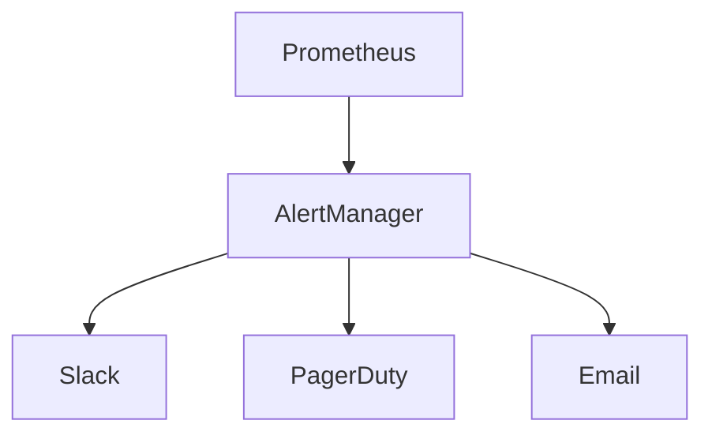

# ALEJO Production Deployment Guide

## Infrastructure Requirements
- Kubernetes cluster with GPU nodes
- Minimum 3 worker nodes (8 vCPU, 32GB RAM each)
- NVMe storage for AI models

## Security Compliance
1. Run quarterly penetration tests
2. Maintain ISO 27001 certification
3. Automate vulnerability scanning in CI/CD

## Theme Park Integration
### Disney
- API key management
- Ride control permissions
- Guest data encryption

### Universal Studios
- Virtual queue configuration
- Character interaction scheduling

## Tesla Factory
- ROS bridge configuration
- Safety system calibration
- Assembly line mapping

## Monitoring & Alerts

