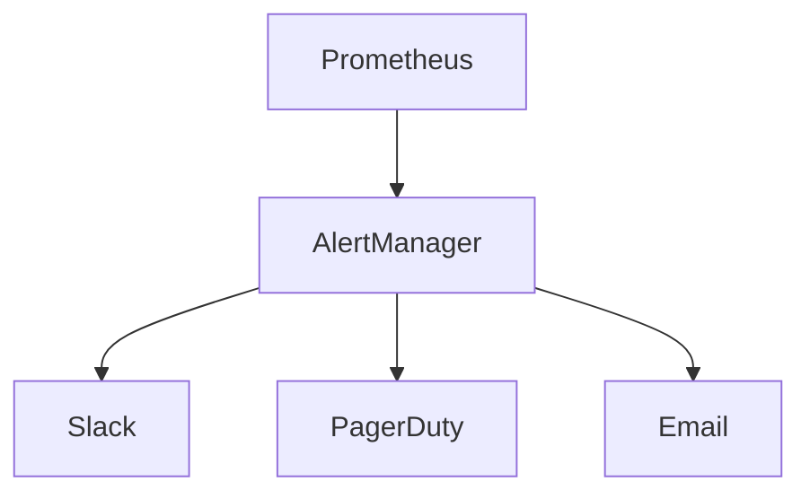

# ALEJO Production Deployment Guide

## Infrastructure Requirements

- Kubernetes cluster with GPU nodes
- Minimum 3 worker nodes (8 vCPU, 32GB RAM each)
- NVMe storage for AI models

## Node.js Environment

The ALEJO Docker containers are built using Node.js v20+ and npm v10+. If you are building the images manually, ensure your build environment has a compatible version.

## Security Compliance

1. Run quarterly penetration tests

2. Maintain ISO 27001 certification

3. Automate vulnerability scanning in CI/CD

## GPU Resource Monitoring

ALEJO now includes real-time GPU monitoring with automatic alerts at 85% memory utilization. This is critical for:

- Preventing overheating in theme park installations

- Maintaining performance during peak loads

- Ensuring safety in robotics applications

To configure thresholds:

```javascript
// In resource-dashboard.js
gpu.setMemoryThreshold(0.85); // 85% threshold
```

## Monitoring & Alerts


