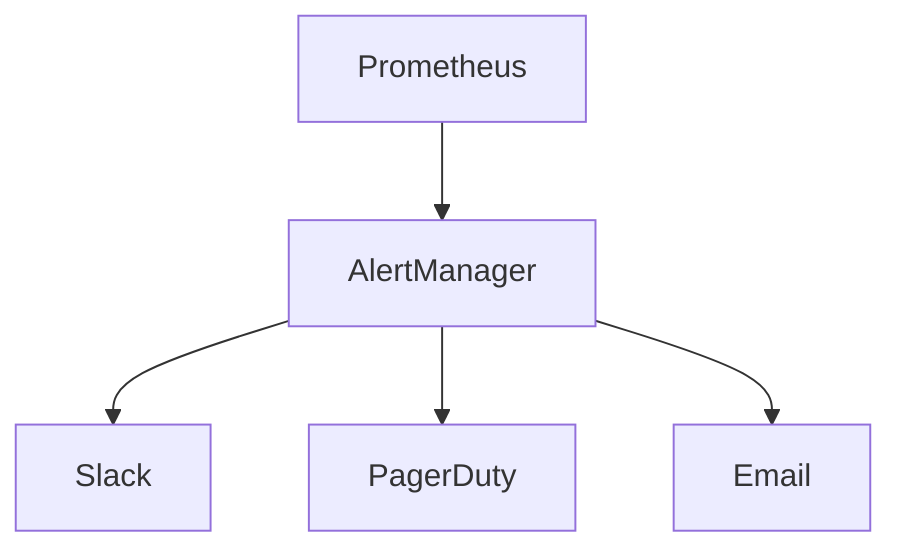

# ALEJO Production Deployment Guide

## Infrastructure Requirements

- Kubernetes cluster with GPU nodes
- Minimum 3 worker nodes (8 vCPU, 32GB RAM each)
- NVMe storage for AI models

## Node.js Requirements

ALEJO requires Node.js v20+ and npm v10+.

**Installation Steps**:

1. Download installer from [nodejs.org](https://nodejs.org)

2. Run installer with default settings

3. Check "Add to PATH" option

4. Reboot after installation

5. Verify with:

   ```powershell
   node --version
   npm --version
   ```

## Security Compliance

1. Run quarterly penetration tests

2. Maintain ISO 27001 certification

3. Automate vulnerability scanning in CI/CD

## Theme Park Integration

### Disney

- API key management

- Ride control permissions

- Guest data encryption

### Universal Studios

- Virtual queue configuration

- Character interaction scheduling

## Tesla Factory

- ROS bridge configuration

- Safety system calibration

- Assembly line mapping

## GPU Resource Monitoring

ALEJO now includes real-time GPU monitoring with automatic alerts at 85% memory utilization. This is critical for:

- Preventing overheating in theme park installations

- Maintaining performance during peak loads

- Ensuring safety in robotics applications

To configure thresholds:

```javascript
// In resource-dashboard.js
gpu.setMemoryThreshold(0.85); // 85% threshold
```

## Monitoring & Alerts


